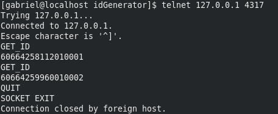

# idGenerator

A class written to generate unique id's fast. It's based on  [Twiter's snowflake](https://github.com/twitter/snowflake/tree/snowflake-2010)
With a more straight forward approach, and probably is a little bit less efficient.

## Generated ID Format

**Example:** 60664889587010008

**Format:** An integer formed by 17 digits. `[XXXXXXXX][YYY][WW][ZZZZ]` where:

* [XXXXXXXX]: The first 8 digits are a custom timestamp, if the default setting was kept this would be `CURRENT_UNIX_TIMESTAMP - 1506204000`
* [YYY]: The next 3 digits are the current ms when the id was generated
* [WW]: The next 2 digits are an process identifier, you can run parallel instances of the id generator, but to avoid conflicts each process should have an unique ID
* [ZZZZ]: The final 4 digits are a sequencial number so you can generate until 9999 ids per milisecond, if you have enough computing power, in case you do, the IdGnerator will wait 1 ms to generate the 10000th id, therefore avoiding duplicates.

## When would you need this?

These are a few of the cases where such a lib could be useful:

* You have multiple codebases / databases and need to ensure unique ids between them. For example, multiple physical mysql shards. Or part of your data is stored in mysql and part is stored on mongodb.
* You are migrating to a database that doesn't provide a id generator facility, like Cassandra.
* You need to generate a large SQL insert sequence and to avoid performance bottlenecks you can't insert each row, fetch its id and then use it on the required relationships. In this case you could generate the ids using the lib beforehand and generate the whole SQL script at once.

## Possible alternatives and motives 

There are a lot of alternatives to these problems, like for example using some other GUID/UUID scheme. But I wanted the same things that Twitter's snowflake wanted:

* An INTEGER id: [because it indexes way better than UUID strings on Mysql](http://kccoder.com/mysql/uuid-vs-int-insert-performance/).
* A sortable id: The ids generated are sortable on the same process, and even if you are using multiple parallel processes they would be roughly sorted
* Extra: Not a design choice, but it was already useful to me that it's time based. I forgot to add some `created_on` columns to my database, since my ids were time based I could use the first 8 digits of it to convert it back to a UNIX_TIMESTAMP and have the data `created_on` historical values. 

You can also use [Twitter's](https://blog.twitter.com/engineering/en_us/a/2010/announcing-snowflake.html) or [Flicker's](https://code.flickr.net/2010/02/08/ticket-servers-distributed-unique-primary-keys-on-the-cheap/) solutions, they are great.
Is my implementation superior by any mean? Probably not. I decided to write it mainly because:
1) I could.
2) I wanted some good use case to study how to work with sockets on PHP.

## Performance

On my localhost env (8gb RAM, SSD, Intel® Core™ i7-7500U CPU @ 2.70GHz × 4) it generates ≃ 20 thousand ids per second per process via TCP, using the lib directly on the source code allows you to generate hundreds of thousands of ids per second though. 

## Install

You can install it by only downloading the class file on the src folder, or you can install it with composer.
Composer package name: webingpro/id-generator

## Usage

### As a lib
You can either use it directly on your source code with the following one liner:
 
```php
$id = IdGenerator\IdGenerator::getId();
```

### As a service
If you have multiple codebases that need to generate unique ids between them, 
you should probably use this as a service.

The service will listen to a TCP port and then you need to communicate with that service via a socket. 
There is a client already written in PHP but it should be straightforward to write the
clients in other languages as well.

#### Test the service:
1) To start the service run the following on your terminal:  
`php src/IdGenerator/Socket/Server.php port=4317 host=127.0.0.1 workerId=01`

2) If everything went ok you should see the following message:
```
 IdGenerator Listening to 127.0.0.1:4317 
```

3) To test the service open a new terminal tab and enter:
```
telnet 127.0.0.1 4317
```
4) Once you are connected to the service via telnet you can run the following commands 
```
GET_ID //To return new ids
QUIT //To close the connection
```


#### How should I properly use this as a service?

If you want to use this in production as a service you should probably 
use something like [supervisord](http://supervisord.org/) to control the spawned processes
and make sure that they are reinitialized if something goes wrong.

There is an example config file for supervisord at the root of this repository.

Once the serve is running with supervisord or something similar, if you are using PHP, 
you can use the provided Client class.

**Example:**

```php
<?php
use IdGenerator\Socket\Client;

require("vendor/autoload.php"); //Require either the composer autoloader or the Client class file
$client = new Client("127.0.0.1","4317"); //Make sure to point to the correct host and port
$id = $client->getId();
var_dump($id);
```

On the provided PHP Client if the client can't connect to the service it will throw an warning
and generate the ID locally using the IdGenerator Object.
When doing so the workerId for the local IdGenerator will be "00", unless you change it by defining the constant:
`ID_GENERATOR_MACHINE_ID` on your code to something else.
 
 
 
## License  MIT

 Permission is hereby granted, free of charge, to any person obtaining a copy
 of this software and associated documentation files (the "Software"), to deal
 in the Software without restriction, including without limitation the rights
 to use, copy, modify, merge, publish, distribute, sublicense, and/or sell
 copies of the Software, and to permit persons to whom the Software is
 furnished to do so, subject to the following conditions:

 The above copyright notice and this permission notice shall be included in
 all copies or substantial portions of the Software.

 THE SOFTWARE IS PROVIDED "AS IS", WITHOUT WARRANTY OF ANY KIND, EXPRESS OR
 IMPLIED, INCLUDING BUT NOT LIMITED TO THE WARRANTIES OF MERCHANTABILITY,
 FITNESS FOR A PARTICULAR PURPOSE AND NONINFRINGEMENT. IN NO EVENT SHALL THE
 AUTHORS OR COPYRIGHT HOLDERS BE LIABLE FOR ANY CLAIM, DAMAGES OR OTHER
 LIABILITY, WHETHER IN AN ACTION OF CONTRACT, TORT OR OTHERWISE, ARISING FROM,
 OUT OF OR IN CONNECTION WITH THE SOFTWARE OR THE USE OR OTHER DEALINGS IN
 THE SOFTWARE.
